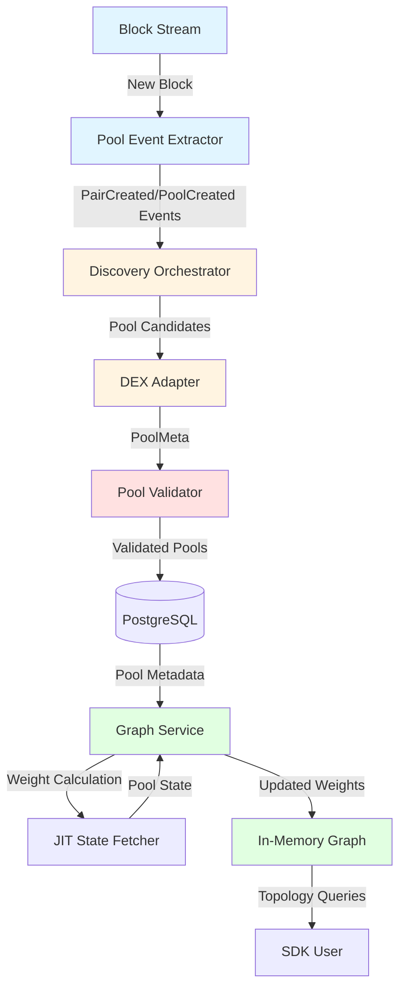
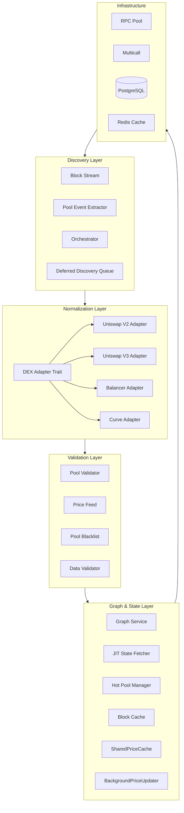
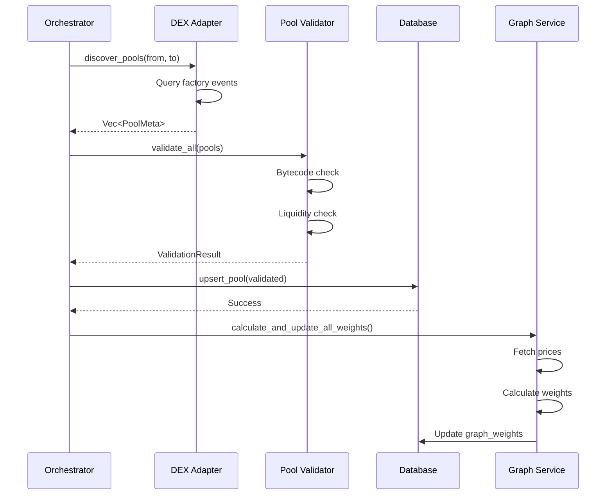
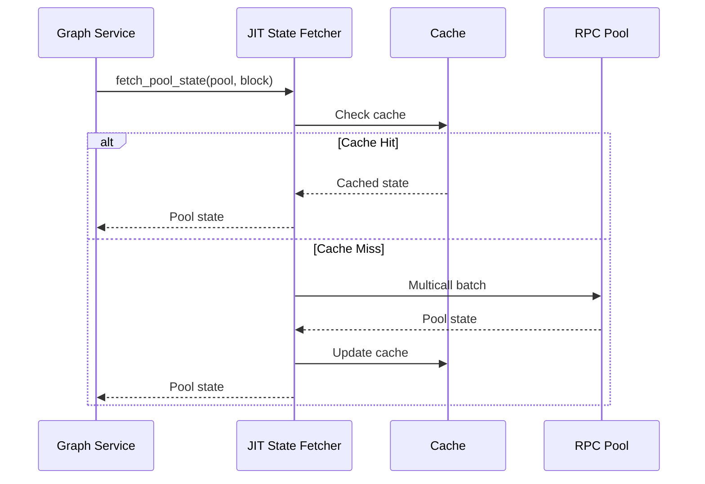
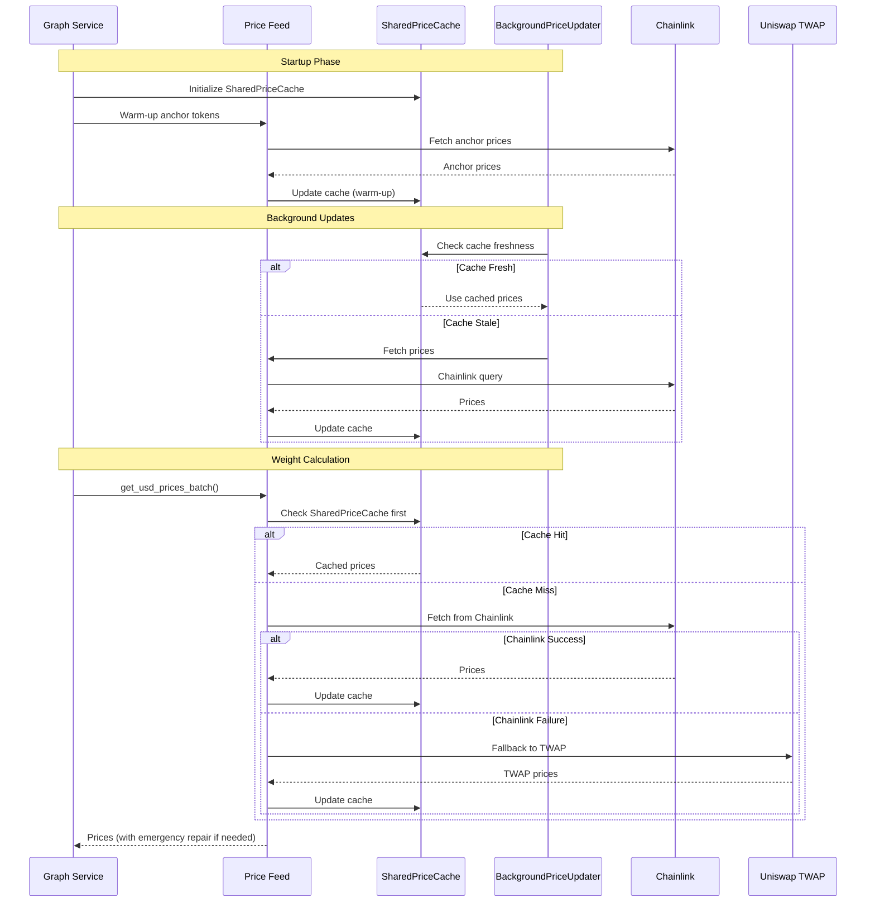
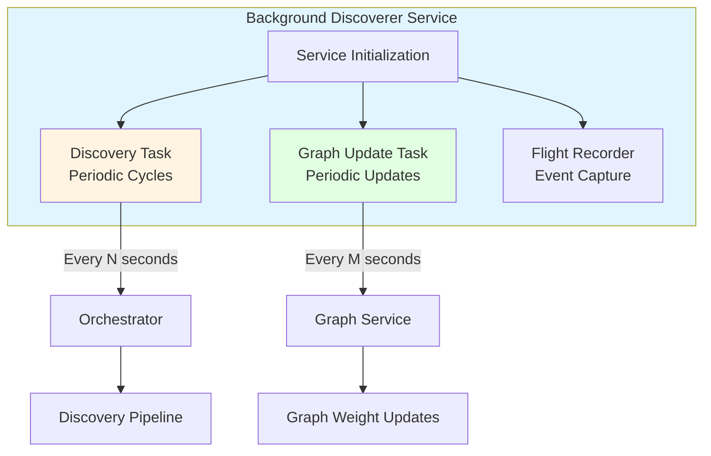
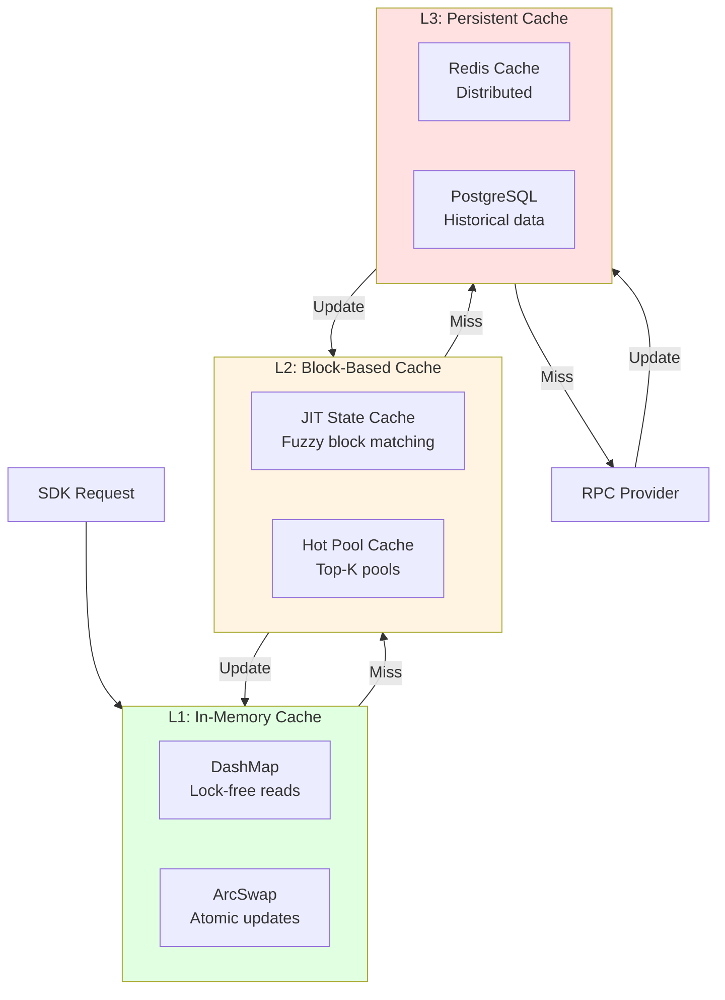
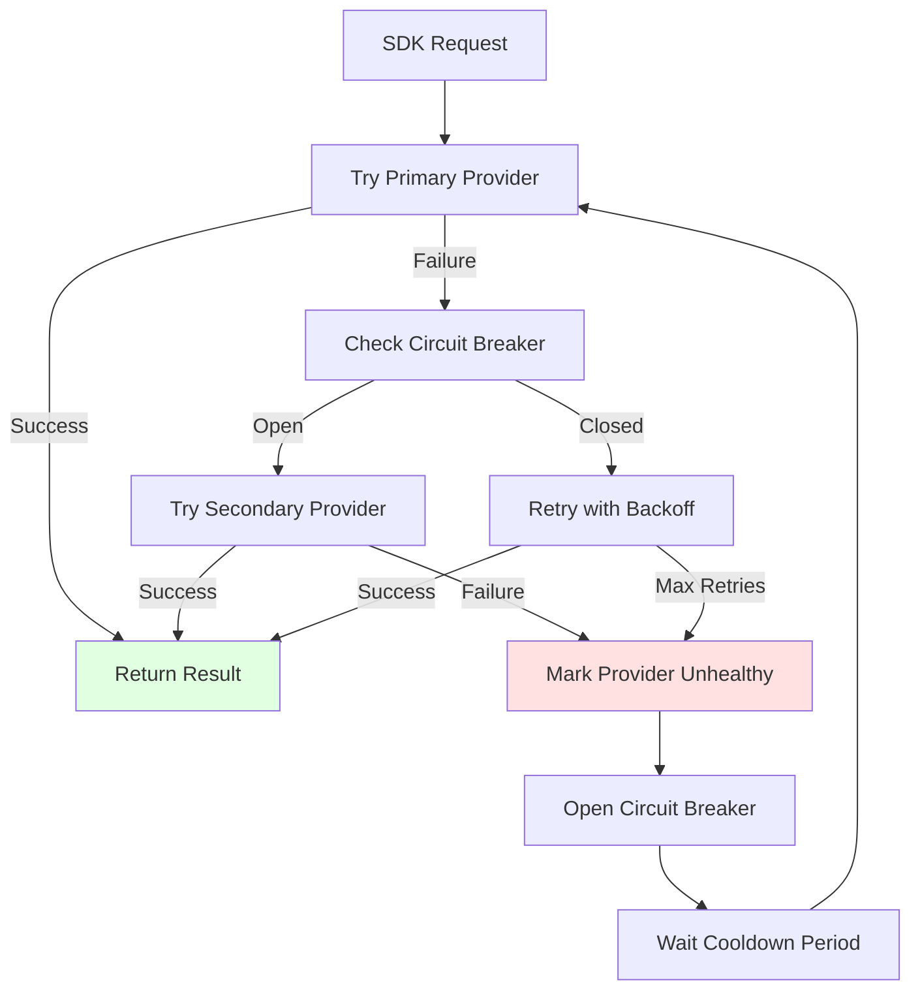

# MIG Topology SDK - Technical Architecture

## Overview

The MIG Topology SDK is a high-performance Rust library designed for real-time liquidity topology mapping on Arbitrum One. This document provides a comprehensive technical overview of the SDK's architecture, data flow, concurrency model, and extensibility mechanisms.

## High-Level Architecture

The SDK is organized into four primary layers:

1. **Discovery Layer**: Event-driven pool discovery from blockchain events
2. **Normalization Layer**: Protocol-agnostic pool representation via adapters
3. **Validation Layer**: Quality assurance and filtering of discovered pools
4. **Graph & State Layer**: Real-time liquidity graph management with JIT state synchronization

## Data Flow

The following diagram illustrates the end-to-end data flow from blockchain events to graph updates:



### Detailed Flow Description

1. **Block Streaming**: The `BlockStream` component monitors new blocks via WebSocket or HTTP polling
2. **Event Extraction**: `PoolEventExtractor` scans blocks for `PairCreated` and `PoolCreated` events from known factory addresses
3. **Discovery**: The `Orchestrator` coordinates discovery across multiple DEX adapters
4. **Normalization**: Each DEX adapter (`UniswapV2Adapter`, `UniswapV3Adapter`, etc.) converts protocol-specific events into unified `PoolMeta` structures
5. **Validation**: The `PoolValidator` performs bytecode verification, liquidity checks, and blacklist filtering
6. **Persistence**: Validated pools are stored in PostgreSQL with metadata
7. **Graph Updates**: The `GraphService` calculates liquidity weights and maintains the in-memory graph
8. **JIT State Fetching**: On-demand state synchronization ensures graph accuracy with minimal RPC calls

## Layer Architecture



## Concurrency Model

The SDK is designed for high-throughput, concurrent operations. The concurrency model leverages Rust's ownership system and several synchronization primitives:

### Thread-Safe Data Structures

#### DashMap for Lock-Free Reads

The graph weights are stored in a `DashMap<Address, f64>`, which provides:
- **Lock-free reads**: Multiple threads can read concurrently without blocking
- **Fine-grained locking**: Only the specific key being modified is locked
- **High throughput**: Designed for read-heavy workloads (typical in graph queries)

```rust
// Example from graph_service.rs
pub struct GraphService {
    weights: Arc<DashMap<Address, f64>>, // Lock-free concurrent map
    // ...
}
```

#### ArcSwap for Atomic Updates

For frequently-read, infrequently-written data, `ArcSwap` provides:
- **Atomic pointer swaps**: Updates are atomic and don't block readers
- **Zero-copy reads**: Readers get a reference without cloning
- **Memory efficiency**: Old versions are automatically garbage collected

#### Arc for Shared Ownership

Most components use `Arc<T>` for shared ownership across threads:
- `Arc<RpcPool>`: Shared RPC provider pool
- `Arc<PriceFeed>`: Shared price feed service
- `Arc<CacheManager>`: Shared cache manager

### Concurrency Patterns

1. **Read-Heavy Graph Queries**: `DashMap` allows thousands of concurrent reads without contention
2. **Background Validation**: Validation runs in separate tasks, updating the graph asynchronously
3. **Parallel DEX Discovery**: Multiple DEX adapters can discover pools concurrently
4. **JIT State Fetching**: State fetches are parallelized using `futures::stream`

### Why Not RwLock?

While `RwLock` is suitable for many scenarios, the SDK uses `DashMap` and `ArcSwap` because:

- **DashMap**: Provides better performance for concurrent reads of a large map (the graph has thousands of pools)
- **ArcSwap**: Eliminates reader-writer lock contention for configuration and shared state
- **Lock-free reads**: Critical for maintaining low latency during graph queries

## DEX Adapter Abstraction

The SDK uses a trait-based architecture for DEX protocol integration. This design allows adding new DEX protocols without modifying core discovery logic.

### DexAdapter Trait

```rust
#[async_trait]
pub trait DexAdapter: Send + Sync {
    fn name(&self) -> &'static str;
    
    async fn discover_pools(
        &self,
        from_block: u64,
        to_block: u64,
        chunk_size: u64,
        max_concurrency: usize,
    ) -> Result<Vec<PoolMeta>>;
    
    async fn fetch_pool_state(&self, pools: &[PoolMeta]) -> Result<Vec<Pool>>;
}
```

### Adding a New DEX Protocol

To add support for a new DEX protocol:

1. **Implement the `DexAdapter` trait**:
   ```rust
   pub struct NewDexAdapter {
       factory: Address,
       // Protocol-specific configuration
   }
   
   #[async_trait]
   impl DexAdapter for NewDexAdapter {
       fn name(&self) -> &'static str {
           "NewDex"
       }
       
       async fn discover_pools(...) -> Result<Vec<PoolMeta>> {
           // Query factory events or registry
           // Convert to PoolMeta
       }
       
       async fn fetch_pool_state(...) -> Result<Vec<Pool>> {
           // Fetch reserves/state
           // Convert to Pool enum variant
       }
   }
   ```

2. **Add Pool enum variant** (if needed):
   ```rust
   pub enum Pool {
       // ... existing variants
       NewDex(NewDexPool),
   }
   ```

3. **Register in Orchestrator**:
   ```rust
   let adapters: Vec<Box<dyn DexAdapter>> = vec![
       // ... existing adapters
       Box::new(NewDexAdapter::new(...)),
   ];
   ```

### Current Adapter Implementations

- **Uniswap V2**: Event-based discovery via `PairCreated` events
- **Uniswap V3**: Event-based discovery via `PoolCreated` events
- **Balancer V2**: Event-based discovery via `PoolRegistered` events
- **Balancer V3**: Event-based discovery for managed pools
- **Curve**: Static registry query (no events, queries MetaRegistry)
- **Camelot V2/V3**: Uniswap V2/V3 compatible with custom factory
- **PancakeSwap**: Uniswap V2 compatible
- **TraderJoe**: Uniswap V2 compatible
- **KyberSwap**: Uniswap V3 compatible

## Component Interactions

### Discovery Cycle



### JIT State Fetching



### Price Feed System with Shared Cache

The SDK implements a sophisticated price feed system with shared caching and background updates:



**Key Components:**

1. **SharedPriceCache**: Thread-safe price cache with freshness metadata
   - Stores prices with `PriceSource` (Chainlink, PoolBased, Hardcoded, Stale)
   - Tracks age and freshness (<5s fresh, 5-30s acceptable, >30s stale)
   - Provides batch lookups with cache statistics

2. **BackgroundPriceUpdater**: Periodic price refresh
   - Updates critical tokens every 5 seconds (configurable)
   - Performs initial warm-up at startup
   - Tracks consecutive failures for health monitoring

3. **Price Warm-up**: Pre-population at startup
   - Fetches anchor token prices before first weight calculation
   - Ensures immediate availability of critical prices
   - Reduces initial weight calculation failures

4. **Emergency Price Repair**: Automatic recovery during weight calculation
   - Detects missing prices during weight calculation
   - Attempts recovery for up to 20 missing tokens
   - Uses longer timeout (1500ms) for repair attempts
   - Updates SharedPriceCache with recovered prices

## ✅ FASE 1-3: Performance Optimizations

### FASE 1: Infrastructure Critical

1. **RPC Pool with Local Node Primary**
   - Local nodes (127.0.0.1/localhost) are automatically prioritized
   - Proactive health checks every 5s for local nodes
   - Circuit breaker only opens if latency >100ms

2. **WebSocket Block Subscription**
   - Real-time block updates via `eth_subscribe("newHeads")`
   - Polling fallback (1s interval) if WebSocket disconnected >5s
   - Automatic reconnection with exponential backoff

3. **Write Batching + Checkpointing**
   - Batches writes every 100ms OR 1000 items (whichever comes first)
   - Checkpointing every 100 blocks (atomic transaction)
   - Non-blocking writes for fast-path operations

### FASE 2: State Optimizations

1. **Streaming Multicall**
   - No hard timeout (uses circuit breaker for latency degradation)
   - Processes results incrementally as they arrive
   - Circuit breaker marks provider unhealthy if latency >100ms

2. **Merkle Tree Cache**
   - Merkle root hash combines block_number and state_hash
   - TTL diferenciado: 30s for touched pools, 5min for others
   - Invalidates only when Merkle root changes (not by block number)

3. **Price Feed Fallback Chain with Shared Cache**
   - Chainlink → CoinGecko → Uniswap V3 TWAP
   - Explicit errors (never returns 0.0 silently)
   - Never caches 0.0 prices
   - **SharedPriceCache**: Thread-safe price cache with freshness metadata
   - **BackgroundPriceUpdater**: Periodic price updates (default: every 5 seconds)
   - **Warm-up**: Pre-populates anchor token prices at startup
   - **Emergency Repair**: Automatic recovery of missing prices during weight calculation

### FASE 3: Resilience and Observability

1. **Event Indexing + Gap Detection**
   - Indexes all pool creation events in `mig_topology.event_index`
   - Automatic gap detection every hour
   - Re-sync capability for detected gaps

2. **PgBouncer Integration**
   - Automatic detection (port 6432 or URL contains "pgbouncer")
   - Transaction pool mode recommended
   - Reduces PostgreSQL connection overhead

3. **Feature Flags**
   - All optimizations can be enabled/disabled via `Config.toml`
   - Allows gradual rollout and A/B testing
   - See `docs/FEATURE_FLAGS.md` for details

## Performance Considerations

### Memory Management

- **Arc for sharing**: Reduces cloning overhead
- **DashMap sizing**: Pre-allocated for expected pool count
- **Cache eviction**: LRU cache for state data prevents unbounded growth

### RPC Optimization

- **Multicall batching**: Combines multiple calls into single RPC request
- **Block number caching**: Reduces redundant `get_block_number()` calls
- **Connection pooling**: RPC pool manages provider connections efficiently
- **Circuit breakers**: Prevents cascading failures from unhealthy providers

### Database Optimization

- **Batch inserts**: Pools are inserted in batches
- **Indexed queries**: Database indexes on `address`, `is_active`, `is_valid`
- **Connection pooling**: PostgreSQL connection pool managed by sqlx

## Error Handling

The SDK uses a combination of error handling strategies:

- **`anyhow::Result`**: For general error propagation with context
- **`thiserror`**: For structured error types (planned migration)
- **Retry logic**: Automatic retries for transient RPC failures
- **Circuit breakers**: Fail-fast for unhealthy providers

## Runtime Architecture

The SDK provides a continuous background service (`background_discoverer`) that runs the complete pipeline for production deployments.

### Background Discoverer Service

The `background_discoverer` binary (`bin/background_discoverer.rs`) orchestrates the complete SDK pipeline:



**Service Responsibilities:**

1. **Discovery Cycles**: Periodically runs `orchestrator.run_discovery_cycle()` to discover and validate new pools
   - Interval: Configurable via `settings.discovery.interval_seconds` (default: 120 seconds)
   - Process: Discovers pools → Validates → Persists to database

2. **Graph Weight Updates**: Periodically runs `graph_service.calculate_and_update_all_weights()` to update liquidity weights
   - Interval: Configurable via `settings.graph.update_interval_seconds` (default: 60 seconds)
   - Process: Loads active pools → Fetches state via JIT Fetcher → Calculates weights → Updates database

3. **Flight Recorder Integration**: Captures all events for observability and benchmarking
   - Events: Discovery cycles, graph updates, RPC calls, errors
   - Output: JSON Lines format to `logs/flight_recorder_*.jsonl`

4. **Graceful Shutdown**: Handles Ctrl+C signals to terminate tasks cleanly

**Usage:**

```bash
# Run the background service
cargo run --bin background_discoverer

# Service runs continuously until Ctrl+C
# Press Ctrl+C for graceful shutdown
```

**Configuration:**

The service uses intervals from `Config.toml`:

```toml
[discovery]
interval_seconds = 120  # Discovery cycle interval

[graph]
update_interval_seconds = 60  # Graph update interval
```

**Integration with SDK Components:**

- **Orchestrator**: Coordinates discovery across DEX adapters
- **GraphService**: Maintains weighted liquidity graph with JIT state fetching
- **JitStateFetcher**: On-demand pool state synchronization (injected into GraphService)
- **Flight Recorder**: Optional event capture for observability
- **Database**: PostgreSQL for persistent storage
- **RPC Pool**: Shared RPC provider pool with health checks

This service architecture enables production deployments where the SDK continuously maintains an up-to-date topology graph.

### SDK Library Usage (Examples)

For programmatic usage (examples, tests, integrations), the SDK components can be initialized and used directly:

- **Examples** (`examples/`): Demonstrate SDK usage patterns
- **Integration**: Components can be instantiated programmatically for custom use cases

See `examples/basic_setup.rs` for a complete initialization example.

## Extension Points

The SDK is designed for extensibility:

1. **New DEX Protocols**: Implement `DexAdapter` trait
2. **Custom Validators**: Extend `PoolValidator` with custom validation logic
3. **Graph Algorithms**: Extend `GraphService` with custom path-finding algorithms
4. **Cache Strategies**: Implement custom cache backends via `CacheManager`

## Security Considerations

- **Bytecode verification**: Pools are validated against known bytecode hashes
- **Input validation**: All addresses and parameters are validated before use
- **No private key storage**: SDK is read-only, no transaction signing
- **Rate limiting**: RPC pool implements rate limiting to prevent abuse

## Cache Architecture

The SDK implements a multi-level caching strategy for optimal performance:



### Cache Levels

1. **L1 (In-Memory)**: `DashMap` and `ArcSwap` for lock-free access
2. **L2 (Block-Based)**: JIT state cache with fuzzy block matching (5 block tolerance)
3. **L3 (Persistent)**: Redis (optional) and PostgreSQL for historical data
4. **Price Cache**: `SharedPriceCache` with freshness metadata and background updates

### Cache Invalidation Strategy

- **Block-Based**: Invalidate when block number changes beyond tolerance
- **State Hash**: Invalidate when pool state hash changes
- **TTL-Based**: Time-based expiration for stale data
- **Manual**: Explicit invalidation for corrupted pools

## Error Recovery & Resilience



## Future Architecture Enhancements

See `docs/ROADMAP.md` for planned architecture improvements:

- Multi-chain support with chain abstraction layer
- Graph query API with subscription system
- Advanced caching strategies for ultra-low latency
- Memory optimization with zero-copy data structures

