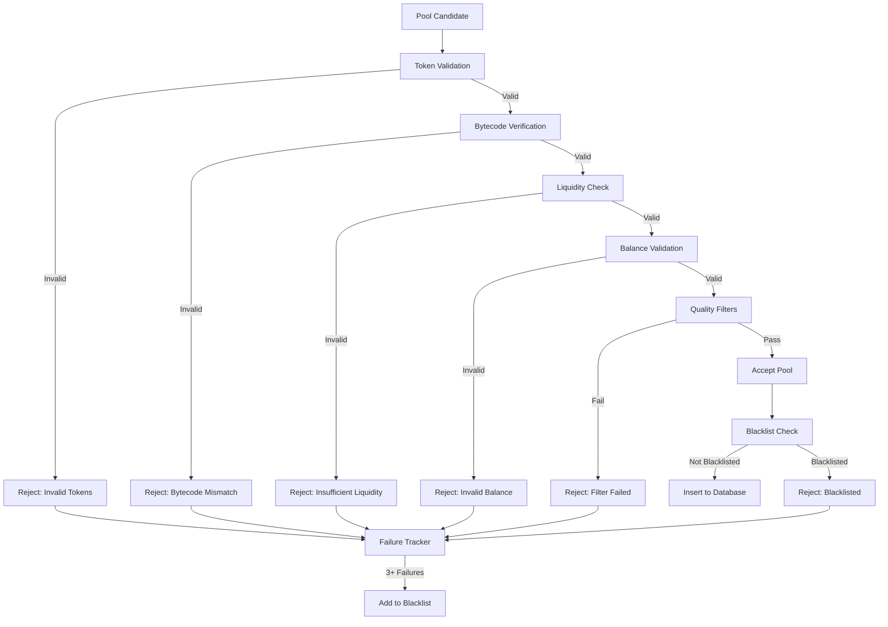

# MIG Topology SDK - Validation & Quality Assurance

## Overview

The MIG Topology SDK implements a comprehensive validation and quality assurance layer to ensure that only high-quality, legitimate liquidity pools are included in the topology graph. This document describes the validation criteria, normalization strategies, and quality management systems.

**Last Updated**: 2024-01-02  
**Version**: 0.1.0

## Pool Validation Criteria

### Bytecode Verification

All discovered pools are validated against known bytecode hashes to ensure they match expected contract implementations.

**Process:**
1. Fetch contract bytecode via RPC call
2. Calculate bytecode hash (Keccak-256)
3. Compare against whitelist of known bytecode hashes
4. Reject pools with mismatched or unknown bytecode

**Configuration:**
Bytecode hashes are configured in `settings.validator.whitelisted_bytecode_hashes` mapping DEX names to expected hashes.

**Implementation:** See `src/validator.rs::PoolValidator::validate_bytecode()`

### Liquidity Filtering

Pools must meet minimum liquidity requirements to be considered valid.

**Criteria:**
- **Anchor Token Requirement**: At least one token in the pair must be an "anchor token" (e.g., WETH, USDC, USDT)
- **Minimum Liquidity**: Pools with zero or insufficient liquidity are filtered out
- **Reserve Validation**: `getReserves()` calls must succeed and return non-zero values

**Anchor Tokens:**
Anchor tokens are high-liquidity, trusted tokens that serve as reference points. The SDK maintains a whitelist of anchor tokens in `settings.validator.anchor_tokens`.

**Implementation:** See `src/pool_filters.rs` and `src/validator.rs::PoolValidator::validate_liquidity()`

### Balance Validation

Pool reserves are validated to ensure data integrity.

**Checks:**
- Both reserves must be non-zero
- Reserves must be retrievable via `getReserves()` (V2) or `slot0()` (V3)
- Reserve values must be within reasonable bounds (not overflow/underflow)

**Error Handling:**
- Transient RPC failures trigger retries (up to 10 attempts)
- Persistent failures result in pool rejection
- Failed pools are logged for analysis

**Implementation:** See `src/validator.rs::PoolValidator::validate_all()`

### Token Validation

Tokens in pools are validated for legitimacy.

**Checks:**
- **Zero Address Check**: Neither token0 nor token1 can be the zero address
- **Same Token Check**: token0 and token1 must be different
- **Blacklist Check**: Pools containing blacklisted tokens are rejected

**Blacklisted Tokens:**
Tokens can be blacklisted in `settings.validator.blacklisted_tokens` for various reasons (scams, low quality, etc.).

**Implementation:** See `src/validator.rs::PoolValidator::validate_tokens()`

### State Quality Classification

Pools are classified by data quality:

```rust
pub enum StateQuality {
    Fresh,   // Recent state, within acceptable block tolerance
    Stale,   // State is older than tolerance but may still be usable
    Corrupt, // State is invalid or corrupted
}
```

**Classification Logic:**
- **Fresh**: State fetched within last 5 blocks or 30ms TTL
- **Stale**: State older than tolerance but structurally valid
- **Corrupt**: State fetch failed, bytecode mismatch, or invalid data

**Implementation:** See `src/data_validator.rs`

## Normalization Strategy

The SDK normalizes pool data from different DEX protocols into a unified representation. This enables protocol-agnostic graph operations.

### Unified Pool Representation

All pools are represented as either:
- `PoolMeta`: Static metadata (address, tokens, DEX, fee)
- `Pool`: Runtime state (reserves, liquidity, tick for V3)

### Decimal Standardization

Different protocols use different decimal precisions. The SDK standardizes to 18 decimals for calculations:

**Uniswap V2:**
- Tokens maintain their native decimals
- Calculations use `U256` for precision
- Conversion to f64 only for display/weight calculations

**Uniswap V3:**
- Uses `sqrtPriceX96` for price representation
- `tick` provides price granularity
- Conversion via `v3_math` utilities

**Balancer:**
- Weighted pools use normalized weights (sum to 1.0)
- Token balances in native decimals
- Normalized to 18 decimals for weight calculations

**Curve:**
- StableSwap pools use A parameter for curve shape
- Balances in native decimals
- Normalized via `normalization.rs` utilities

**Implementation:** See `src/normalization.rs` and `src/types/conversions.rs`

### Protocol-Specific Conversions

#### Uniswap V2 → PoolMeta

```rust
PoolMeta {
    address: pair_address,
    factory: factory_address,
    token0: pair.token0(),
    token1: pair.token1(),
    dex: "UniswapV2",
    fee: None, // V2 has fixed 0.3% fee
}
```

**State Conversion:**
```rust
Pool::UniswapV2(UniswapV2Pool {
    address: meta.address,
    token0: meta.token0,
    token1: meta.token1,
    reserve0: reserves.0,
    reserve1: reserves.1,
})
```

#### Uniswap V3 → PoolMeta

```rust
PoolMeta {
    address: pool_address,
    factory: factory_address,
    token0: pool.token0(),
    token1: pool.token1(),
    dex: "UniswapV3",
    fee: Some(fee_bps), // e.g., 3000 for 0.3%
}
```

**State Conversion:**
```rust
Pool::UniswapV3(UniswapV3Pool {
    address: meta.address,
    token0: meta.token0,
    token1: meta.token1,
    fee: meta.fee.unwrap(),
    sqrt_price_x96: slot0.sqrt_price_x96,
    liquidity: liquidity,
    tick: slot0.tick,
})
```

#### Balancer → PoolMeta

```rust
PoolMeta {
    address: pool_address,
    factory: vault_address,
    pool_id: pool_id,
    token0: tokens[0],
    token1: tokens[1],
    dex: "Balancer",
    pool_type: Some("Weighted".to_string()),
}
```

**State Conversion:**
```rust
Pool::BalancerWeighted(BalancerWeightedPool {
    address: meta.address,
    pool_id: meta.pool_id.unwrap(),
    tokens: tokens,
    balances: balances,
    weights: weights,
})
```

#### Curve → PoolMeta

```rust
PoolMeta {
    address: pool_address,
    factory: registry_address,
    token0: coins[0],
    token1: coins[1],
    dex: "Curve",
    pool_type: Some("StableSwap".to_string()),
}
```

**State Conversion:**
```rust
Pool::CurveStableSwap(CurveStableSwapPool {
    address: meta.address,
    coins: coins,
    balances: balances,
    A: A_parameter,
})
```

**Implementation:** See `src/adapters/` for protocol-specific adapters

## Blacklist Management

The SDK maintains a blacklist of pools that have repeatedly failed validation or exhibit corruption.

### Blacklisting Criteria

A pool is blacklisted when:
- **3+ consecutive validation failures**: Pool fails validation 3 times in a row
- **Bytecode mismatch**: Pool bytecode doesn't match expected hash
- **Persistent RPC failures**: Pool consistently fails to respond to RPC calls
- **Corrupt state data**: Pool returns invalid or corrupted state data

### Blacklist Duration

- **Default**: 24 hours from first failure
- **Escalation**: Repeated failures extend blacklist duration
- **Automatic expiration**: Blacklist entries expire automatically

### Blacklist Implementation

```rust
pub struct PoolBlacklist {
    blacklisted: DashMap<Address, BlacklistEntry>,
}

struct BlacklistEntry {
    failure_count: u32,
    first_failure: Instant,
    last_failure: Instant,
    reason: String,
}
```

**Features:**
- Thread-safe concurrent access via `DashMap`
- Automatic expiration of old entries
- Failure count tracking for escalation

**Implementation:** See `src/pool_blacklist.rs`

### Corruption Tracking

The SDK tracks pool corruption patterns to identify systemic issues:

- **Global corruption tracker**: Shared across all validators
- **Failure aggregation**: Tracks failure rates per pool
- **Pattern detection**: Identifies pools with high failure rates

**Use Cases:**
- Identify pools with intermittent failures
- Detect protocol-wide issues
- Optimize validation strategies

## Pool Filters

Additional filters are applied to improve data quality:

### Effective Liquidity Filter

Filters pools based on effective liquidity (considering price impact):

```rust
pub fn filter_effective_liquidity_too_low(
    pool: &Pool,
    min_effective_liquidity_usd: f64,
) -> bool {
    // Calculate effective liquidity considering slippage
    // Reject if below threshold
}
```

### Price Deviation Filter

Filters pools with excessive price deviation from oracle:

```rust
pub fn filter_price_deviation_too_high(
    pool: &Pool,
    oracle_price: f64,
    max_deviation_bps: u32,
) -> bool {
    // Compare pool price to oracle price
    // Reject if deviation exceeds threshold
}
```

### Stale Data Filter

Filters pools with stale state data:

```rust
pub fn filter_stale_data(
    last_updated_block: u64,
    current_block: u64,
    max_staleness_blocks: u64,
) -> bool {
    // Check block age
    // Reject if too stale
}
```

**Implementation:** See `src/pool_filters.rs`

## Validation Pipeline

The complete validation pipeline:



## Quality Metrics

The SDK tracks quality metrics for monitoring:

- **Validation Success Rate**: Percentage of pools that pass validation
- **Blacklist Size**: Number of currently blacklisted pools
- **Corruption Rate**: Percentage of pools marked as corrupt
- **State Quality Distribution**: Breakdown of Fresh/Stale/Corrupt states

**Implementation:** See `src/metrics.rs` for metric definitions

## Best Practices

### For SDK Users

1. **Monitor validation metrics**: Track success rates to identify issues
2. **Review blacklist**: Periodically review blacklisted pools for false positives
3. **Adjust thresholds**: Tune liquidity and quality thresholds based on use case
4. **Handle stale data**: Implement fallback strategies for stale pool states

### For Contributors

1. **Add new validators**: Extend `PoolValidator` with custom validation logic
2. **Improve filters**: Add new quality filters in `pool_filters.rs`
3. **Optimize normalization**: Improve conversion efficiency in `normalization.rs`
4. **Enhance blacklist**: Add smarter blacklist expiration and recovery logic

## Configuration

Validation behavior is configured via `settings.validator`:

```toml
[validator]
whitelisted_factories = ["0x...", "0x..."]
whitelisted_bytecode_hashes = { "UniswapV2" = "0x..." }
anchor_tokens = ["0x...", "0x..."]
blacklisted_tokens = []
min_liquidity_usd = 1000.0
max_price_deviation_bps = 500
```

See `src/settings.rs` for complete configuration options.

