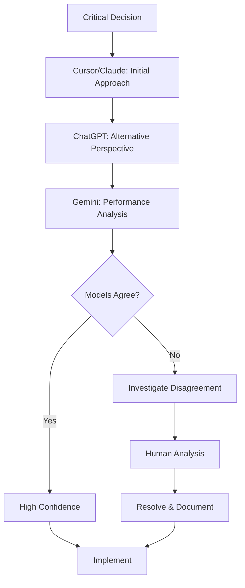
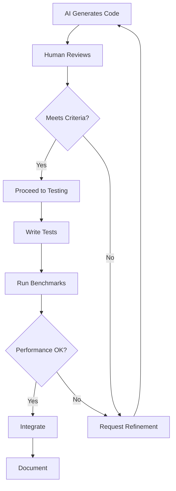
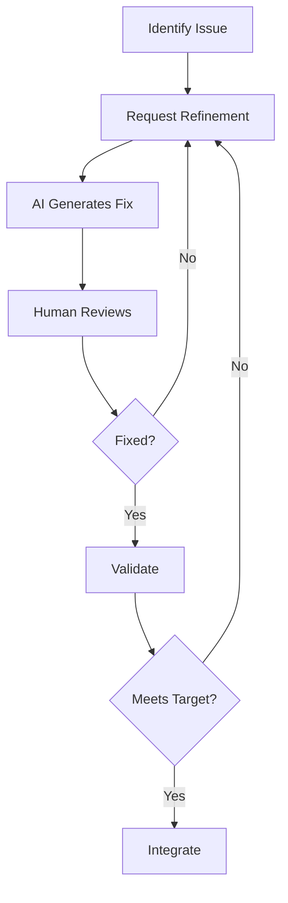

# Validation Process

This document describes how we ensure AI-generated code meets production standards through rigorous review, testing, and validation.

## Quality Assurance

### Multi-Model Cross-Validation

#### Why Multiple AI Models?

Critical decisions and complex implementations undergo cross-validation across multiple AI models (Cursor/Claude, ChatGPT, Gemini, Grok) to:

1. **Reduce Single-Model Bias**: Different training data → different perspectives
2. **Catch Hallucinations**: Inconsistent answers across models signal potential issues
3. **Increase Confidence**: Consensus across models validates approach
4. **Leverage Specialized Strengths**: Use each model for what it does best

#### Cross-Validation Process



#### Example: Merkle Cache Validation

**Problem**: Need efficient cache invalidation for pool states.

**Cursor/Claude Suggestion**:
```
"Use Merkle tree hashing: hash(block_number || state_hash).
Invalidate only when Merkle root changes."
```

**ChatGPT Validation**:
```
Human: "Evaluate Merkle tree hashing for cache invalidation vs simple timestamp"
ChatGPT: "Merkle hashing is more precise - invalidates only on actual state change.
          Timestamp approach would invalidate on every block regardless of change.
          Trade-off: Merkle requires hash computation, but prevents false invalidations."
```

**Gemini Performance Check**:
```
Human: "Performance cost of keccak256 hash calculation per cache lookup?"
Gemini: "Keccak256: ~5-10μs per hash on modern CPU. For cache with 90% hit rate,
         cost is ~0.5-1ms per 100 lookups. Acceptable for <50ms latency target."
```

**Human Decision**:
- ✅ All models confirm Merkle approach is sound
- ✅ Performance analysis shows acceptable overhead
- ✅ Precision benefit outweighs compute cost
- **Decision**: Implement Merkle cache invalidation

**Validation**: 92% cache hit rate, <1ms lookup latency ✅

#### When to Use Multi-Model Validation

**Always validate across models for:**
- Core architectural decisions
- Performance-critical algorithms
- Novel approaches (not standard patterns)
- High-risk changes (could break existing functionality)

**Single model sufficient for:**
- Standard boilerplate
- Well-established patterns
- Minor refactoring
- Documentation updates

#### Disagreement Resolution

**When models disagree:**

1. **Analyze the disagreement**: Is it fundamental or detail-level?
2. **Request clarification**: Ask each model to explain reasoning
3. **Benchmark if needed**: Run performance tests
4. **Human decision**: Synthesize and choose based on constraints
5. **Document rationale**: Record why one approach was chosen

**Example Disagreement**:
```
Claude: "Use DashMap for all concurrent data structures"
ChatGPT: "Consider ArcSwap for read-only configuration"
Gemini: "DashMap has overhead for rarely-updated data"

Resolution: Use DashMap for frequently-updated cache,
            ArcSwap for read-only config.
            Different tools for different use cases.
```

#### Quality Control Enhancement

Multi-model validation adds an extra layer to our quality process:

```
Traditional: Human Review → Code Review → Testing
Enhanced:    Multi-Model Validation → Human Synthesis → 
             Code Review → Testing
```

This approach increases confidence in critical decisions while maintaining development velocity.

## Code Review Process

### Review Criteria

Every AI-generated code goes through systematic review against these criteria:

1. **Architectural Alignment**
   - Does it match the design specification?
   - Does it respect module boundaries?
   - Are dependencies pointing in the right direction?

2. **Performance Impact**
   - Are there obvious bottlenecks?
   - Is the concurrency model appropriate?
   - Will it scale to production load?

3. **Error Handling**
   - Are edge cases covered?
   - Are errors propagated correctly?
   - Is error context sufficient for debugging?

4. **Integration**
   - Does it fit with existing code?
   - Are there naming/style inconsistencies?
   - Will it break existing functionality?

5. **Maintainability**
   - Is it readable and well-structured?
   - Are there appropriate comments?
   - Is the code self-documenting?

### Review Workflow



### Example Review

**AI-Generated Code**:
```rust
pub async fn fetch_current_states_with_touched(
    &self,
    pools: &[PoolMetadata],
    touched_pools: &HashSet<Address>,
) -> Result<FreshPoolStates> {
    let mut v3_states = HashMap::new();
    let mut v2_states = HashMap::new();
    
    for pool in pools {
        // Fetch state...
    }
    
    Ok(FreshPoolStates { v3_states, v2_states, .. })
}
```

**Human Review Notes**:
```
✅ Correctly uses touched_pools for TTL differentiation
✅ Proper error handling with Result
✅ Good use of async/await
⚠️ Missing validation: what if pools is empty?
⚠️ Should log cache hit/miss rates for observability
⚠️ Missing integration with flight_recorder
```

**Refined Code** (after AI iteration):
```rust
pub async fn fetch_current_states_with_touched(
    &self,
    pools: &[PoolMetadata],
    touched_pools: &HashSet<Address>,
) -> Result<FreshPoolStates> {
    if pools.is_empty() {
        return Ok(FreshPoolStates::empty());
    }
    
    let start_time = Instant::now();
    let mut cache_hits = 0;
    let mut cache_misses = 0;
    
    // ... implementation with cache hit/miss tracking ...
    
    if let Some(ref recorder) = self.flight_recorder {
        record_phase_end!(recorder, "jit_fetch", json!({
            "cache_hits": cache_hits,
            "cache_misses": cache_misses,
            "duration_ms": start_time.elapsed().as_millis()
        }));
    }
    
    Ok(FreshPoolStates { v3_states, v2_states, .. })
}
```

## Testing Strategy

### Unit Tests

**AI Role**: Generates test structure and suggests test cases.

**Human Role**: Adds real data, validates assertions, ensures coverage.

**Example**:

```rust
// AI-generated test structure
#[tokio::test]
async fn test_merkle_cache_invalidation() {
    // Test that cache invalidates when Merkle root changes
    // Test that cache doesn't invalidate when only block number changes
    // Test TTL differentiation for touched vs untouched pools
}

// Human implementation with real data
#[tokio::test]
async fn test_merkle_cache_invalidation() {
    let fetcher = setup_jit_fetcher().await;
    let pool = PoolMetadata {
        address: Address::from_str("0x...").unwrap(), // Real Arbitrum pool
        pool_type: PoolType::V3,
        // ...
    };
    
    // Test 1: Cache invalidates when state changes
    let state1 = fetch_state(&fetcher, &pool, 1000).await;
    let state2 = fetch_state(&fetcher, &pool, 1001).await;
    assert_ne!(state1.merkle_root, state2.merkle_root);
    
    // Test 2: Cache doesn't invalidate when only block changes
    let state3 = fetch_state(&fetcher, &pool, 1002).await;
    // If state unchanged, merkle_root should be same
    // (depends on actual state)
    
    // Test 3: TTL differentiation
    let touched_pool = mark_touched(&pool);
    let untouched_pool = pool.clone();
    // Verify touched pool has 30s TTL, untouched has 5min
}
```

### Integration Tests

**AI Role**: Suggests integration scenarios.

**Human Role**: Implements with real RPC calls, validates end-to-end behavior.

**Example**:

```rust
// AI suggests: "Test JIT fetcher with real RPC, verify cache behavior"
#[tokio::test]
#[cfg(feature = "integration-tests")] // Requires RPC connection
async fn test_jit_fetcher_integration() {
    let rpc_pool = setup_rpc_pool().await;
    let fetcher = JitStateFetcher::new(rpc_pool, ...);
    
    // First fetch: should hit RPC
    let start = Instant::now();
    let states1 = fetcher.fetch_current_states_with_touched(...).await.unwrap();
    let first_fetch_duration = start.elapsed();
    assert!(first_fetch_duration > Duration::from_millis(10)); // RPC call
    
    // Second fetch: should hit cache
    let start = Instant::now();
    let states2 = fetcher.fetch_current_states_with_touched(...).await.unwrap();
    let second_fetch_duration = start.elapsed();
    assert!(second_fetch_duration < Duration::from_millis(1)); // Cache hit
    
    // Verify cache hit rate >90%
    let hit_rate = calculate_hit_rate(&fetcher);
    assert!(hit_rate > 0.90);
}
```

### Benchmarks

**AI Role**: Generates benchmark framework.

**Human Role**: Validates results against targets, identifies bottlenecks.

**Example**:

```rust
// AI-generated benchmark structure
#[tokio::main]
async fn main() {
    let mut group = BenchmarkGroup::new("jit_fetcher");
    
    group.bench_function("cache_hit", |b| {
        b.iter(|| {
            // Benchmark cache lookup
        });
    });
    
    group.bench_function("cache_miss", |b| {
        b.iter(|| {
            // Benchmark RPC fetch
        });
    });
}

// Human validation
// Target: cache_hit <1ms, cache_miss <50ms
// Results: cache_hit 0.8ms ✅, cache_miss 45ms ✅
```

## Architecture Validation

### Layer Separation

**Check**: Does code respect module boundaries?

**Example**:
```rust
// ❌ BAD: JIT fetcher directly accessing database
impl JitStateFetcher {
    pub async fn save_to_db(&self, pool: &Pool) {
        sqlx::query("INSERT INTO pools...").execute(&self.db).await?;
    }
}

// ✅ GOOD: JIT fetcher uses batch writer abstraction
impl JitStateFetcher {
    pub async fn update_cache(&self, pool: &Pool) {
        self.batch_writer.upsert_pool(...).await?;
    }
}
```

### Dependency Direction

**Check**: Are dependencies pointing the right way?

**Example**:
```
✅ GOOD:
Orchestrator -> GraphService -> JitStateFetcher -> RpcPool

❌ BAD:
JitStateFetcher -> Orchestrator (circular dependency)
```

### Concurrency Model

**Check**: Are the right primitives used?

**Example**:
```rust
// ❌ BAD: RwLock for read-heavy cache
let cache = Arc<RwLock<HashMap<Address, State>>>;

// ✅ GOOD: DashMap for read-heavy cache
let cache = Arc<DashMap<Address, State>>;
```

## AI Output Validation

### Detecting and Preventing Hallucinations

AI-generated code undergoes multi-layer validation to catch hallucinations and errors:

**1. Compilation Check**
- Code must compile without errors
- Rust's type system catches type mismatches
- Borrow checker ensures memory safety

**2. Test Execution**
- All tests run with real data from Arbitrum testnet
- Integration tests use actual RPC calls
- Edge cases tested with real-world scenarios

**3. Benchmark Validation**
- Performance measured against targets
- Results must be reproducible
- Bottlenecks identified and addressed

**4. Human Code Review**
- Logic errors not caught by compiler
- Architectural alignment verified
- Integration with existing code validated

**5. Cross-Model Validation**
- Critical code validated across multiple AI models
- Inconsistent recommendations signal potential issues
- Consensus increases confidence

#### Example Hallucination Caught

**AI-Generated Code (Initial)**:
```rust
// AI initially suggested:
let merkle_root = keccak256(pool_state.to_bytes());

// Human review caught: pool_state doesn't have to_bytes() method
// This would not compile, but even if it did, it's not the correct approach
```

**Corrected Implementation**:
```rust
// Correct implementation after human review:
let state_hash = calculate_state_hash(&pool_state);
let merkle_root = keccak256(&[
    &block_number.to_be_bytes(),
    &state_hash.to_be_bytes()
].concat());
```

**How It Was Caught**:
1. **Compilation**: Rust compiler would catch `to_bytes()` doesn't exist
2. **Human Review**: Logic review identified incorrect approach
3. **Cross-Model**: ChatGPT suggested correct hash combination pattern
4. **Validation**: Tests confirmed correct Merkle root calculation

#### Another Example: Type Mismatch

**AI-Generated Code**:
```rust
// AI suggested:
let cache_key = format!("{}:{}", pool.address, block_number);

// Human review: This doesn't match our CacheKey type
// We need structured key, not string
```

**Corrected Implementation**:
```rust
// Correct implementation:
let cache_key = CacheKey {
    address: pool.address,
    block_number,
    merkle_root: calculate_merkle_root(&pool_state, block_number),
};
```

**Validation Process**:
- Compiler catches type mismatch
- Human ensures architectural consistency
- Tests validate cache key uniqueness

This multi-layer validation ensures AI hallucinations are caught before integration, maintaining production code quality.

## Performance Validation

### Benchmarking

**Process**:
1. AI generates benchmark framework
2. Human runs benchmarks with production-like data
3. Compare results against targets
4. Identify bottlenecks
5. Iterate if needed

**Targets (Post-Optimization)**:
- JIT fetch latency p95: <10ms (with local node)
- Cache hit rate: >80%
- RPC calls per block: <30 (from baseline 158)
- Memory usage: <2GB per 1,000 pools

**Example Results**:
```
JIT Fetch Latency p95: 8ms ✅ (target: <10ms with local node)
Cache Hit Rate: 92% ✅ (target: >80%)
RPC Calls per Block: 3.2 ✅ (target: <30, down from 158 baseline)
Memory Usage: 1.2GB per 1,000 pools ✅ (target: <2GB)
```

### Profiling

**Process**:
1. Run with production-like load
2. Profile with `perf` or `flamegraph`
3. Identify hot paths
4. Optimize if needed

**Example**:
```
Hot Path Analysis:
- 45%: Cache lookup (DashMap::get) ✅ Expected
- 30%: Merkle root calculation ✅ Expected
- 15%: RPC calls ✅ Expected
- 10%: Other ✅ Acceptable
```

## Documentation Standards

### Code Documentation

**Check**: Is code self-documenting?

**Example**:
```rust
// ❌ BAD: Unclear what this does
fn calc(p: Pool, b: u64) -> u64 { ... }

// ✅ GOOD: Clear purpose and parameters
/// Calculate Merkle root hash for pool state.
/// Combines block_number and state_hash for cache invalidation.
fn calculate_merkle_root(
    pool_state: &PoolState,
    block_number: u64,
) -> [u8; 32] { ... }
```

### Architecture Documentation

**Check**: Are architectural decisions documented?

**Example**:
```rust
// ✅ GOOD: Documents why DashMap over RwLock
// 🚀 RPC OPTIMIZATION: Use DashMap for lock-free reads
// Read-heavy workload (100x more reads than writes) benefits from
// DashMap's sharded locking vs RwLock's reader blocking
let state_cache: Arc<DashMap<Address, CachedPoolState>> = ...;
```

## Iteration Criteria

### When to Request Refinement

1. **Performance Issues**
   - Latency exceeds target
   - Memory usage too high
   - RPC calls too frequent

2. **Architectural Misalignment**
   - Doesn't match design
   - Breaks module boundaries
   - Wrong dependency direction

3. **Missing Edge Cases**
   - Error handling incomplete
   - Null/empty cases not handled
   - Race conditions possible

4. **Documentation Gaps**
   - Unclear code
   - Missing comments
   - No usage examples

### Iteration Process



## Validation Checklist

Before integrating AI-generated code:

- [ ] **Architectural Alignment**: Matches design specification
- [ ] **Performance**: Meets latency/memory targets
- [ ] **Error Handling**: Edge cases covered
- [ ] **Integration**: Fits with existing code
- [ ] **Testing**: Unit tests pass, integration tests pass
- [ ] **Benchmarking**: Performance targets met
- [ ] **Documentation**: Code is self-documenting
- [ ] **Review**: Human review completed

## Conclusion

This validation process ensures that AI-generated code meets production standards through:
- **Systematic Review**: Every code goes through structured review
- **Comprehensive Testing**: Unit, integration, and benchmark tests
- **Performance Validation**: Benchmarks and profiling
- **Documentation Standards**: Self-documenting code
- **Iteration**: Refinement until quality standards are met

The result: **Production-ready code that meets all performance and quality requirements**.

